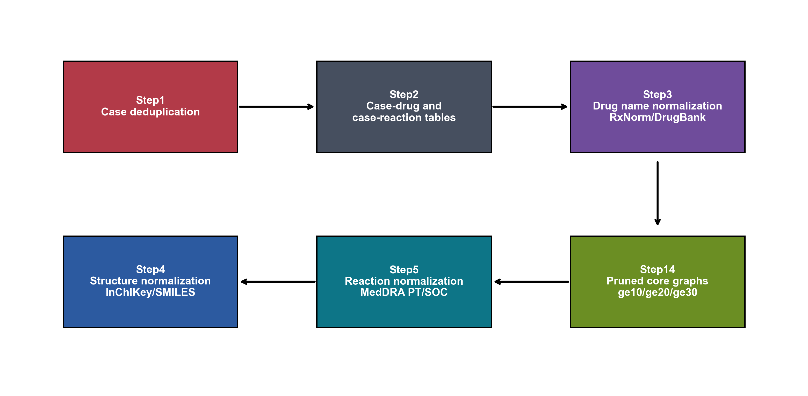
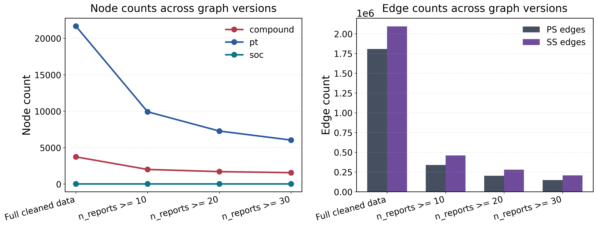

# FAERS Preprocessing and Core Heterograph Package

This repository-ready package contains only data collection notes, preprocessing code, curated documentation, figures, and three pruned FAERS core graphs. It does not include any downstream modeling or prediction results.

## Workflow Overview



## Scope

The package documents how raw FAERS data were transformed into standardized compound-PT-SOC graphs using:

- FAERS / AERS quarterly ASCII archives from 2004Q1 to 2025Q4
- RxNorm `RxNorm_full_03022026`
- DrugBank `5.1.15`
- MedDRA `29.0` English and Chinese

## Main outputs

- `docs/`: process notes and execution notes
- `figures/`: English workflow and graph summary figures
- `graphs/`: three pruned graph archives (`ge10`, `ge20`, `ge30`) compressed as `.sqlite.gz`
- `code/`: final preprocessing and graph-building scripts

## Graph definition

Each core graph keeps only:

- node types: `compound`, `pt`, `soc`
- edge types: `compound_has_pt_ps`, `compound_has_pt_ss`, `pt_belongs_to_primary_soc`

`compound -> pt` edges are weighted by `n_reports`, defined as the number of FAERS reports where the compound and PT co-occur under the given role (`PS` or `SS`).

## Graph versions

The package provides three pruned graph versions:

- `ge10`: keep `compound -> pt` edges with `n_reports >= 10`
- `ge20`: keep `compound -> pt` edges with `n_reports >= 20`
- `ge30`: keep `compound -> pt` edges with `n_reports >= 30`

The recommended default graph is `ge20`, which gives the best tradeoff between coverage and noise control.

## Graph Summary



## Files included in this public repository

- `README.md`
- `docs/`
- `figures/`
- `graphs/`
- `code/`

## Files intentionally not uploaded

The public repository does not include the full cleaned reference tables, including:

- all compounds table
- all PT bilingual table
- all SOC bilingual table
- full PS compound-PT association table
- full SS compound-PT association table

These files are retained only in the local expert package.

## Notes about graph archives

Graph archives are compressed as `.sqlite.gz` to make GitHub publication feasible. Use standard gzip tools to decompress them:

```bash
gzip -d compound_pt_role_core_ge20.sqlite.gz
```
